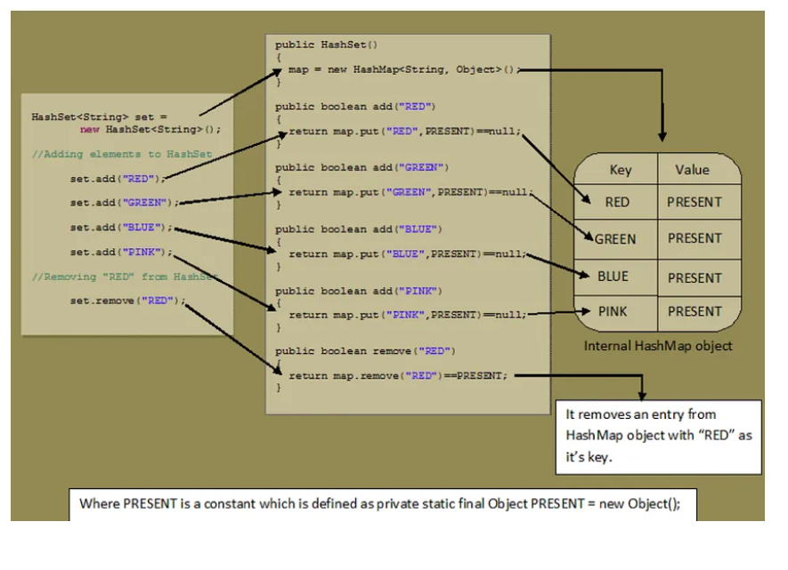
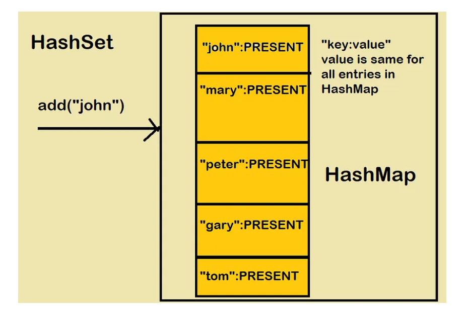

### HashSet uses HashMap internally to store data in the form of Key-Value pair where key will the actual element value and value will be the 𝑷𝑹𝑬𝑺𝑬𝑵𝑻 Constant.
### Elements are stored using 𝒉𝒂𝒔𝒉𝒊𝒏𝒈 𝒕𝒆𝒄𝒉𝒏𝒊𝒒𝒖𝒆, therefore elements are not stored in an ordered fashion and the elements will be returned in random order.

### This class permits at most 𝒐𝒏𝒆 𝒏𝒖𝒍𝒍 𝒆𝒍𝒆𝒎𝒆𝒏𝒕 because HashMap allows only one null key.
### HashSet has default initial capacity of 16.
### HashSet has default load factor of 0.75 or 75%.
### HashSet does not have any method(like get(key) in HashMap) to retrieve the object directly.
### The only way to retrieve objects from the HashSet is through iterating the entire HashSet. This can be achieved by using iterator, for, for-each ,etc.
### The iterators returned by HashSet class iterator method are fail-fast: if the set is modified at any time after the iterator is created, in any way except through the iterator’s own remove method, the Iterator throws a 𝑪𝒐𝒏𝒄𝒖𝒓𝒓𝒆𝒏𝒕𝑴𝒐𝒅𝒊𝒇𝒊𝒄𝒂𝒕𝒊𝒐𝒏𝑬𝒙𝒄𝒆𝒑𝒕𝒊𝒐𝒏.

### Internal working of hash set

### private static final Object PRESENT = new Object();

### add() method of HashSet class.
    public boolean add(E e) {
        return map.put(e, PRESENT)==null;
    }

### add() method of HashSet class internally calls put() method of backing HashMap object by passing the element you have specified as a key and constant “PRESENT” as it’s value.
### remove() method also works in the same manner.

public boolean remove(Object o) {
return map.remove(o)==PRESENT;
}